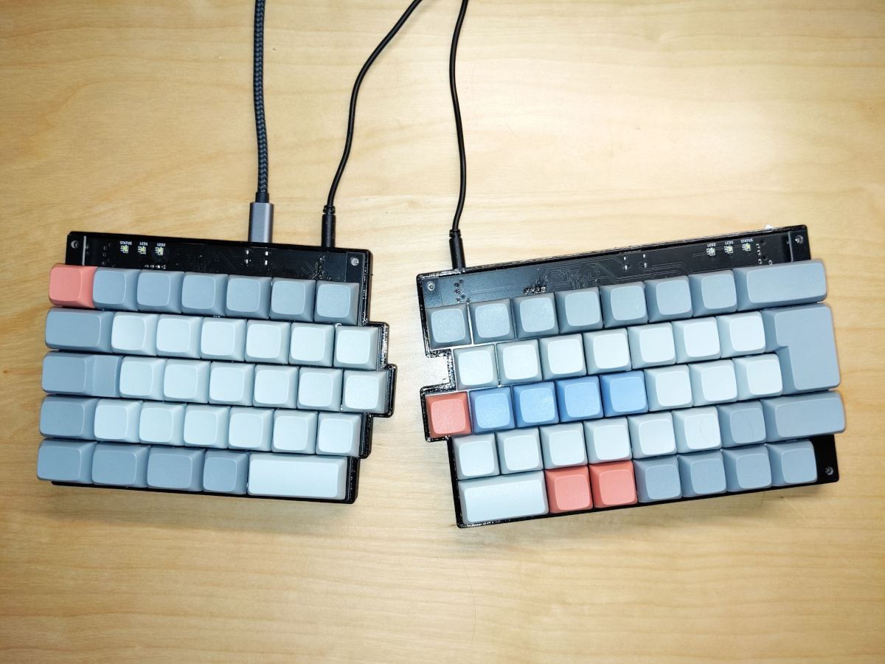

#  Maykb - a custom split keyboard for ISO-DE users
Maykb is a split keyboard using a staggered ISO layout including the ISO-Enter. Other features are one duplicated column in the middle (for people who don't always use the same finger for those middle keys) and the inclusion of an additional key left of the `h` which I use as a backspace key.

## PCB
The PCBs for maykb are based on a STM32F103 and Cherry MX switches.
Both halves communicate using a UART interface and are equipped to be chainable, i.e. you could chain together more keyboards so you could add a numpad or a dedicated macropad if you wanted to.

There is also no fixed host MCU; both sides can act as the host and communicate over USB.

The initial revision of the PCB has one flaw: The voltage regulator for the MCU is not enabled properly due to a enable pin polarity mistake. Fixing this mistake involves lifting a pin of that regulator and wiring it properly.
I plan to replace the regulator eventually and fix the schematic and layout at that point as well.
As far as I know, there are no other hardware issues that would keep you from building one of these keyboards.

## Firmware
### Application
The firmware for the keyboard is written in Rust and uses [keyberon](https://github.com/TeXitoi/keyberon).
You need to build two different firmware versions for the left and right side so the firmware knows which part of the matrix it's working on.

### Bootloader
I'm using a slightly modified version of the [stm32duino-bootloader](https://github.com/rogerclarkmelbourne/STM32duino-bootloader).
This allows easy DFU flashing when you change the firmware.
The bootloader can be entered by holding the top left key of each side or by holding down the bootloader key on the bottom side of the PCB.

## Construction
The maybkb case is designed to be 3D-printed and design files are available as OpenSCAD code.
It should be easy to adjust the code to allow for different screw tolerances or even brass screw inserts.

As a small novelty, the plates can be manufactured as aluminium PCBs (I had good results with JLCPCB), which is cheaper than all laser cutting services I was able to locate.
It should also be possible to export the plate PCB files as a DXF file and use another fabrication technique.

The PCB is a simple 1.6mm thick two layer PCB and should be easily manufactured at any prototyping company.